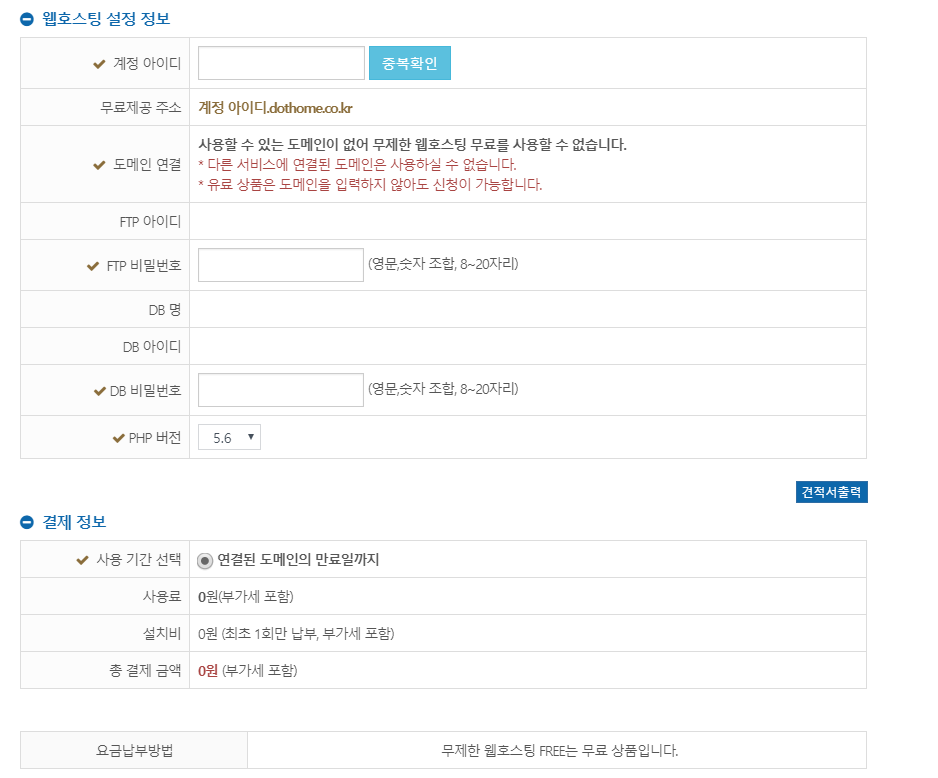
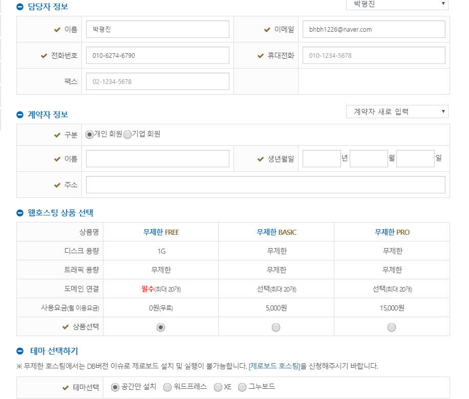

# 2018 설리번 강의계획서

## 개요

### 교육 개요

* 주제 : 나만의 다이어리 사이트 만들기!!!!!!!!

* 테마 : 내 다이어리 사이트를 내가 만든다!!

* 목표 : 나만의 다이어리를 만들어보자

### 수업 개요

* 대표 : 디미고 박평진(대표) 연락처 : 010-6274-6790
* 강의자 : 박평진, 이원준, 서동하, 한효민
* 지역 : 모두들 보충하기 때문에 안산에서 가까운 대도시(학생이 많이 몰릴 곳) (안양, 수원, 서울)
* 총 수업 차시 : 12차시
* 각 차시별 수업시간 : 3시간
* 강의 대상 : 예비 중3 ~ 예비 고2
* 강의 인원 : 8명

## 진행 방식

* 모든 수업은 복습을 통하여 제대로 아는 것이 아는 것인지!
* 재밌게! 학생들의 참여를 이끌어갈 것입니다.
* 학생들의 자발적 참여와 수업의 집중을 위해 수업진행마다 배웠던 것들을 선생님이 질문하는 형태로 진행될 예정입니다.
* 주제 : '나만의 다이어리 사이트 만들기'를 목표로 탑을 쌓아가는 교육입니다.

## 수업의 목표

* 학생들이 HTML을 자유자재로 룰 줄 앎.
* HTML을 CSS로 꾸밀 줄 앎.
* JS의 기본 문법
* PHP 기본 문법 및 파일 입출력과 같은 응용 가능.
* 나만의 다이어리 사이트를 만듦.

### 다이어리 사이트의 개요

* 기본 기능
    * 제목 작성
    * 글 작성 가능
    * 저장 가능 (txt파일로)
    * 썼던 거 볼 수 있는 기능
    * 별표

* 학생들이 Customizing 할 수 있는 것
    * 이쁘구
    * 잘생기구
    * 로고 = LUNA

* 수업을 잘 따라가는 학생들에게 추가로 제공할 것들
    * 제목
    * 폰트
    * 달력 추가
    * 사진 추가
    * 자동 날씨 기입

## 차시별 기획

### 1차시 - OT & 기본 지식
* 목표ㅣ
    * 강의자와 학생간의 교육이 원활히 진행될 정도의 친밀감 형성, 학생의 코딩에 대한 기본 지식을 알려주어 이후 커리큘럼 이 잘 되도록 함.

* 내용
    * 오리엔테이션
        * 강의자 소개
        * 설리번 소개
        * 커리큘럼 소개
          * 나만의 다이어리 사이트 만들기!!
        * Ice Breaking

    * 프로그래밍이란?
        * 프로그래밍이 멀까요?
            * 프로그램을 만드는 행위!
        * 웹이 뭘까요?
            * 웹은 사람들이 인터넷에서 올려서 웹들을 볼 수 있음.
        * 웹 브라우저
            * 웹 브라우저는 사람들이 올린 HTML파일을 번역해줌!
        * 사용할 언어 간단 소개 - html, css, js
        * 웹의 구동 방식
            * 서버의 주소
            * HTML
            * 브라우저 번역
            * 서버에 HTML 파일 올리고 사용자가 가져오고 브라우저가 해석하고 보는 것!

### 2차시 - HTML
 * 복습
     * 전 시간에 배운 개념들 간단한 소개
 * 목표
     * HTML에 대하여 익숙해 지고, HTML의 여러가지 tag들 각각의 역할을 이해, HTML에 익숙해짐.
 * 내용
   * HTML
     * 네이버, 다음, Google 등의 사이트에서 F12 보여주면서 우왕
     * tag 설명
       * 기본 tag들 여러가지
       * table이랑 이미지 입력 관련
     * 그외 여러 tag들은 너무 방대한 양이고 필요한 것을 GOOGLE에성

### 3차시 - HTML 심화
* 복습
    * 지금까지 배웠던 태그들 복습!
* 목표
    * 다이어리를 만드는 데 필요한 tag를 학습하고, 응용하는 능력을 기름.
* 내용
    * 필요한 태그들
        * img태그
        * form태그
        * input태그
            * form, input 태그 심화 알기.
            * form action
            * input name
            * submit 햇을 때 생기는 1
        * list태그
        * button태그
    * HTML을 통해 다이어리 페이지의 큰 틀 짜기

    * [w3schools HTML](https://www.w3schools.com/quiztest/quiztest.asp?qtest=HTML)에서 HTML 복습하는 문제 풀기!
        * 그 후, 집에서 풀어서 사진을 찍으면 초코파이 증정해주는 이벤트 열기!

### 4차시 - 오잉 CSS?
* 복습
    * 배웠던 태그들 총 정리!
* 목표
    * CSS의 기본 개념을 학습하여 응용할 줄 암.

* 내용
    * 여러 속성들
        * background-color

    * 단위
        * px cm % em rem

    * Box Model
        * margin
        * border
        * padding
        * size

    * Selector
        * . # > :hover

    * position
        * relative absolute
        * top left right bottom

### 5차시 - CSS!
* 복습
    * CSS의 단위, Box Model, Selector, Position 관련되어 질문하기
* 목표
    * 다이어리 페이지 꾸미기

* 내용
    * 선생님들 하나하나 자신이 만든 다이어리 소개!
    * 자신만의 방식대로 다이어리 페이지를 꾸민다.
        * 사진 넣기
        * 색깔 넣기 등등
    * 자신이 만든 페이지를 발표하고, 추가 하고 싶은 것 말하기

    * [w3schools CSS](https://www.w3schools.com/quiztest/quiztest.asp?qtest=CSS)에서 CSS 복습하는 문제 풀기!
        * 그 후, 집에서 풀어서 사진을 찍으면 초코파이 증정해주는 이벤트 열기!

### 6차시 - JS
* 복습
* 목표
    * JS로 HTML의 각 요소의 내용을 마음대로 바꿀 수 있다!!
    * JS를 통해 프로그래밍의 변수와 연산자를 배움!!

* 내용
    * innerHTML
        * HTML에 있는 글 변경
    * 변수
        * 사과박스
    * 연산자
        * 사칙연산
        * 대입연산
        * 비교연산

### 7차시 - JS
* 복습
    * 변수, 사칙연산 문제 내기
* 목표

* JS의 조건 및 반복을 배우고 예제를 통해 학습하기

* 내용
    * 배열
        * array
    * 조건
        * if
        * if else
    * 반복
        * while
        * for
        * do while
    * 배열과 반복을 응용하여 배열 안에 있는 것들 출력하는 프로그램 만들기

### 8차시 - JS
* 복습
    * 배열, 조건, 반복에 대한 문제 내기
    * while과 for문의 차이

* 목표
    * 함수요?

* 내용
    * 함수란?
    * 함수 만들어보기
    * 매개변수란?
    * 익명함수란?
    * 함수를 사용하여 구구단을 출력하는 함수 만들기!
    * [w3schools JS](https://www.w3schools.com/quiztest/quiztest.asp?qtest=JavaScript)에서 JS 복습하는 문제 풀기!
        * 그 후, 집에서 풀어서 사진을 찍으면 초코파이 증정해주는 이벤트 열기!

### 9차시 - JS 응용
* 복습
    * 함수란?
    * 함수 만들기
    * 익명함수란?

* 목표
    * 버튼을 클릭했을 때! 여러가지 동작 실행시키기
    * heroku 가입!

* 내용
    * onclick 속성?
    * 무슨 함수를 만들어볼까?
    * 버튼 클릭했을 때 함수 실행하기!

    * form에서 버튼 클릭했을 때
        * query란?
        * query가 넘겨오는 것 보기

    * heorku 가입하기!
    * heorku-cli 설치하기!

### 10차시 - PHP
* 복습
    * onclick속성이란?
    * form 넘겨받은 값 이 뭐였지?

* 목표
    * heroku에 php를 올릴 수 있다!

* 내용
    * echo "냠냠" 하는 php파일 만들어보기
    * heroku에 올리기.
    * php 기본!
    * echo로 출력해보기!
    * 정말 간단한 php 문법! (JS에서 배울 건 거의 배웠기 때문에 그것과 연계함)
    * 변수 배열 조건 반복!
    * Form 값 처리하기!

### 11차시 - PHP
* 복습
    * PHP 간단한 복습!
        * PHP 문법
        * Form 값 처리하기

* 목표
    * Form으로 값 처리한 것 저장하기!

* 내용
    * 파일 저장하기 fopen!
    * fwrite
    * fread
    * 파일 저장하는 것 보여주기(보여주는 함수만 알려줌(개념 설명 X)해서 저장이 되었는지 확인)
    * form으로 넘겨받은 값 파일에다 저장하기!
    * 내가 쓴 일기를 파일에다 저장하는 페이지 만들기!
    * 내가 쓴 일기를 보여주는 페이지 만들기!

### 12차시 - 마무리
* 복습
    * 파일 쓰기, 읽는 방법

* 목표
    * 내가 만든 다이어리 페이지!!

* 내용
    * 내가 만든 다이어리 꾸미기
    * 지금까지 배웠던 것을 이용하여 다이어리 페이지 완성
    * 자신이 만든 다이어리 페이지 발표하기!!

## 1차 피드백

### 1) 학생들이 집에 가서도 스스로 배운 내용을 복습해보게 하는 방법은 무엇이 있을까요?

사실 저희는 이 문제에 대하여 과제를 생각해냈습니다! 학생들이 집에서 과제를 함으로써, 실력도 항상되고 복습도 하는 그런 방법을 생각했었습니다!

하지만 여러 사람들의 피드백을 받음으로써 생각이 달라졌습니다!

과제는 학생들이 하기 싫어할 수 있으며, 과제를 내줘도 정작 하지 않는다는 문제점 때문입니다.

그래서 저희는 재밌게 복습할 수 있는 방법을 찾게 되었습니다
바로 HTML 퀴즈입니다!
w3schools, codeacamedy와 같은 많은 사이트에서 HTML과 CSS와 같은 프로그래밍에 대한 문제들을 내주는 사이트가 있었습니다!

예를 들면,

>  HTML은 어떤 말의 줄임말일까요?
>
> 제목을 쓰기 위해서는 어떤 태그가 필요할까요?

와 같은 질문이지요!

저희는 이 질문 사이트들을 적극 활용하려고 합니다!

일단 저희는 간단하게 수업을 마친 후에 간단하게 이 사이트에서 몇 문제를 풀어볼 것이며,

집에서 여기 중 어느 사이트에서든! 이 문제를 풀어서 가족과 함께라던지, 사진을 찍었을 경우, 간단한 선물을 제공하는 방식으로 하려고 합니다! 예를 들어 초코파이처럼요

가족과 함께 문제를 푸는 것도 괜찮고, 아무래도 괜찮습니다! 저희의 목적은 아이들이 자율적으로 문제를 풀게 하는 것입니다!

다음은 사이트의 예시입니다!

* w3schools의 HTML과 CSS, JS에 대한 퀴즈

    * [w3schools HTML](https://www.w3schools.com/quiztest/quiztest.asp?qtest=HTML)

    * [w3schools CSS](https://www.w3schools.com/quiztest/quiztest.asp?qtest=CSS)

    * [w3schools JS](https://www.w3schools.com/quiztest/quiztest.asp?qtest=JavaScript)

* codeacademy의 HTML과 CSS에 대한 퀴즈

    * [codeacademy html&css](https://www.codecademy.com/skills/uk-quizzes/topics/uk-html-basics/html-basics-1)

* KHANACademy의 HTML과 CSS에 대한 퀴즈

    * [khanacademy html&css](https://ko.khanacademy.org/computing/computer-programming/html-css-js/html-css-js-intro/e/quiz--html-css-recap)

* ProProps의 HTML과 CSS에 대한 퀴즈

    * [proprops html&css](https://www.proprofs.com/quiz-school/story.php?title=html-exam-1)

### 2) Heroku를 이용한 방법이 최선의 선택일까요? (최선의 선택이 아니라는 이야기가 아닙니다! 어떤 이유로 heroku를 선택했는지가 알고 싶어요!)

> 커리큘럼에서 HEROKU를 사용하는 이유

heroku는 외국의 클라우드 사이트입니다. 계정 생성, Application 생성이 무료이며, 초보자들이 쉽게 사용할 수 있는 클라우드 사이트입니다.

heroku를 선택한 이유는, 비교적 적은 정보로 가입을 할 수 있고, 또한 heroku-cli 설치, git 올리는 형식으로 파일 업로드, 간단한 앱 제작 가능 을 이유로 뽑았습니다.

heroku에서 앱을 만드는 방법은
1. 앱을 만든다
2. 로컬 디렉토리에서 heroku-git으로 파일을 올린다
3. heroku 원격 저장소에 올린다
4. 앱을 열어본다

이게 끝입니다.

php 설정도 따로 필요하지 않고,

php 파일도 알아서 실행해줍니다.

쩌러요

그런데 그와 비슷한 무료 호스팅인 dothome에서는

* 회원가입페이지

* 호스팅 신청 페이지

초기 설정이 매우 복잡하며, 학생들에게 이 칸들을 작성하게 시키기엔 컨트롤이 어려울 것 같았습니다

C를 맨 처음 배울 때, Visual Studio를 설치하게 되면 처음 환경설정이 어려워서 프로그래밍에 대한 흥미가 떨어지는 학생이 있듯, 일단 테스트 웹이기 때문에 환경설정부분을 더욱 간단한 heroku를 선택하였습니다.

또한 dothome은 ftp로 파일들을 올리는 방식이기에  heroku에 대한 기능을 제공하는 heroku-cli와 heroku-git을 선택하게 되었습니다.

### 3) 자바스크립트의 언어적 특성에 대해 다루는 것이 좋은 선택일까요? 아닐까요? 학생들에게 어떤 정보를 제공하는 게 가장 좋은 선택일까요?

자바스크립트의 언어적 특성이란

1. 'HTML과 CSS와는 다르게 스크립트 언어이며, 웹사이트의 동작을 다룰 때 쓰는 언어이다.'
2. '인터프리팅 언어이며 싱글 스레드로 작동하고, 객체 지향 언어이다.'

이 둘 중에 무엇을 의미하는 건가요??
1번과 같은 기본 상식적인 부분은 알려줘야할 것 같습니다!
하지만 2번과 같은 프로그래밍 언어로서의 특징은 간단한 다이어리 사이트를 만드는 저희의 커리큘럼과 맞지 않다고 생각합니다!

JS만 사용하는 것이 아닌, PHP도 사용하더라도, 심화적인 부분을 알려주는 것 보다는, JS와 PHP의 차이점과 같은 상식부분을 알려주는 것이 더 맞다고 생각합니다!

감사합니다!!
